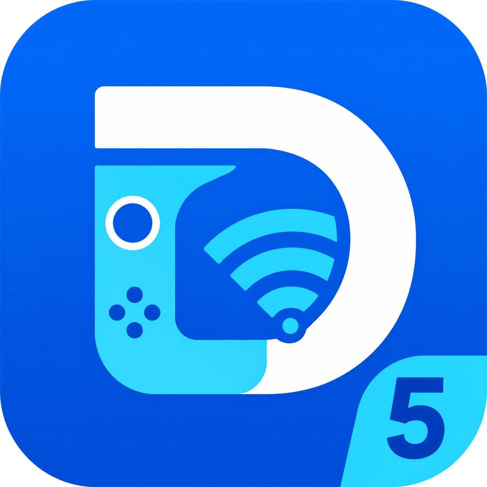

<p align="center">
  
</p>

<h1 align="center">DS4Wifi Controller</h1>

<p align="center">
  <strong>Use seu DualShock 4 sem fio — do seu celular Android para o PC.</strong>
</p>

<p align="center">
  <a href="#features-en"></a>
  <a href="#features-en"></a>
  <a href="#tech-stack-en"></a>
  <a href="#tech-stack-en"></a>
  <a href="#license-en"></a>
  <a href="#tech-stack-en"></a>
</p>

<p align="center">
  
  
</p>

---

## Idiomas / Languages
- [Português (Brasil)](#versão-em-português)
- [English](#english-version)

---

## Versão em Português

### Descrição

O DS4Wifi permite que você use o seu celular Android como uma ponte sem fio para conectar seu controle DualShock 4 ao computador. Ao conectar o controle físico no celular via USB ou Bluetooth, o DS4Wifi transmite os comandos através da rede local (ou via cabo usando ADB reverse) para o computador, onde um controle virtual de PS4 é criado através do driver ViGEmBus.

O projeto é composto por duas partes principais:

| Componente | Localização | Descrição |
|-----------|----------|-------------|
| **Android App** | `android/` | Aplicativo em Kotlin que lê os comandos do controle conectado ao celular e envia via TCP |
| **PC Server** | `pc/` | Servidor em Python com interface em terminal (Rich) que recebe os pacotes e emula o controle de PS4 |

O computador reconhece o dispositivo como um DualShock 4 padrão, o que significa que funciona com compatibilidade total nos jogos, incluindo vibração física repassada do PC de volta para o controle conectado ao celular.

### Funcionalidades

- Emulação completa de DualShock 4 (botões, analógicos, gatilhos e direcional).
- Transmissão de comandos em tempo real por rede local ou cabo USB (via ADB reverse).
- Suporte a vibração nativa em jogos compatíveis.
- Interface simples estilo terminal no servidor de PC com suporte a inglês, português e espanhol.
- Leitura do nível de bateria do controle exibida tanto no celular quanto no dashboard do PC.
- Otimização de latência usando canais assíncronos em Kotlin e TCP_NODELAY.
- Executável autônomo (.exe) para o servidor do PC, sem necessidade de instalar o Python.

### Requisitos

#### Computador (PC)
- Windows 10 ou mais recente.
- Driver do ViGEmBus instalado no sistema.
- Python 3.10+ (apenas se for rodar o código-fonte manualmente).

#### Celular (Android)
- Android com suporte a USB OTG.
- Um controle DualShock 4.

#### Conexão
- Opção A: Cabo USB ligando o celular ao PC (usando ADB reverse para menor latência).
- Opção B: Celular e PC conectados na mesma rede sem fio (WiFi).

### Como Instalar

#### Servidor no PC

**Opção 1 (Executável pré-compilado):**
Execute o arquivo `DS4WifiServer.exe` localizado dentro da pasta `pc/`. Não é necessário instalar nenhuma outra dependência além do driver ViGEmBus.

**Opção 2 (Código fonte):**
```bash
# Instale as dependências necessárias
pip install vgamepad rich

# Inicie o servidor
python pc/server.py
```

#### Aplicativo Android

Compile o código do projeto usando o Gradle ou abra a pasta no Android Studio:
```bash
cd android
./gradlew assembleDebug
```
Depois, instale o arquivo APK gerado no seu aparelho.

### Como Usar

1. Certifique-se de ter instalado o driver do ViGEmBus no Windows.
2. Conecte o controle DualShock 4 ao celular via cabo OTG ou Bluetooth.
3. Conecte o celular ao computador:
   - Se for usar WiFi: Garanta que ambos estão na mesma rede.
   - Se for usar cabo: Ative a depuração USB e rode o servidor do PC, que fará o redirecionamento de porta automaticamente.
4. Execute o `DS4WifiServer.exe` no computador (ou rode via script Python).
5. Escolha o idioma no console do PC e inicie o servidor.
6. Abra o aplicativo DS4Wifi no celular. Ele tentará se conectar de forma automática. Caso a conexão falhe, ele repetirá o processo a cada 2 segundos até conseguir parear.

---

## English Version

### Description

DS4Wifi allows you to use your Android phone as a wireless bridge to connect your DualShock 4 controller to your PC. By connecting the physical controller to the phone, DS4Wifi streams the input packets over the local network (or via USB cable using ADB reverse) to the computer, where a virtual PS4 controller is created using the ViGEmBus driver.

The project is split into two components:

| Component | Location | Description |
|-----------|----------|-------------|
| **Android App** | `android/` | Kotlin application that captures gamepad events and streams them over a TCP socket |
| **PC Server** | `pc/` | Python server with a terminal interface (Rich) that receives the packets and emulates a virtual DualShock 4 |

Games see a native DualShock 4 device, meaning full compatibility, including rumble support sent back from PC games directly to the controller on your phone.

### Features

- Complete DualShock 4 emulation (buttons, axes, triggers, and D-pad).
- Real-time streaming over local WiFi or USB cable (via ADB reverse).
- Native rumble/vibration feedback support.
- Clean terminal UI for the PC server with English, Portuguese, and Spanish language options.
- Real-time controller battery level reporting displayed on both client and server UIs.
- Latency optimizations using Kotlin Channels and TCP_NODELAY.
- Pre-compiled standalone executable (.exe) for the PC server.

### Requirements

#### PC
- Windows 10 or newer.
- ViGEmBus driver installed.
- Python 3.10+ (only required if running from the source code).

#### Android
- Android device with USB OTG support.
- DualShock 4 controller.

#### Connection
- Option A: USB connection using ADB reverse (recommended for lowest latency).
- Option B: Both devices connected to the same local WiFi network.

### Installation

#### PC Server

**Option 1 (Pre-compiled Executable):**
Run the `DS4WifiServer.exe` file located inside the `pc/` folder.

**Option 2 (Source Code):**
```bash
# Install dependencies
pip install vgamepad rich

# Run the server
python pc/server.py
```

#### Android App

Build the project from source:
```bash
cd android
./gradlew assembleDebug
```
Then install the generated APK file on your device.

### Usage

1. Ensure the ViGEmBus driver is installed on Windows.
2. Connect your controller to the phone via Bluetooth or USB OTG.
3. Connect the phone to the computer (either over WiFi or via USB debugging cable).
4. Run `DS4WifiServer.exe` on your PC.
5. Select your language in the terminal prompt and start the server.
6. Open the DS4Wifi app on your phone. It will attempt to connect automatically, retrying every 2 seconds if the server is not ready yet.

---

## Tech Stack

| Layer | Technology |
|-------|-----------|
| **Android App** | Kotlin, Coroutines, VibratorManager API |
| **PC Server** | Python, vgamepad, Rich, PyInstaller |
| **Communication** | TCP sockets with JSON payloads |
| **Gamepad Driver** | ViGEmBus (virtual DualShock 4) |

---

## Project Structure

```
DS4Wifi/
├── android/              # Android app (Kotlin)
│   ├── app/              # Main application module
│   ├── build.gradle.kts  # Project build config
│   └── ...
├── pc/                   # PC server (Python)
│   ├── server.py         # Main server script
│   ├── DS4WifiServer.exe # Pre-built executable
│   └── ...
├── logo.png              # Project logo
└── README.md             # This file
```

---

## License

This project is licensed under the MIT License - see the [LICENSE](LICENSE) file for details.

```
MIT License

Copyright (c) 2026 DS4Wifi Contributors

Permission is hereby granted, free of charge, to any person obtaining a copy
of this software and associated documentation files (the "Software"), to deal
in the Software without restriction, including without limitation the rights
to use, copy, modify, merge, publish, distribute, sublicense, and/or sell
copies of the Software, and to permit persons to whom the Software is
furnished to do so, subject to the following conditions:

The above copyright notice and this permission notice shall be included in all
copies or substantial portions of the Software.

THE SOFTWARE IS PROVIDED "AS IS", WITHOUT WARRANTY OF ANY KIND, EXPRESS OR
IMPLIED, INCLUDING BUT NOT LIMITED TO THE WARRANTIES OF MERCHANTABILITY,
FITNESS FOR A PARTICULAR PURPOSE AND NONINFRINGEMENT. IN NO EVENT SHALL THE
AUTHORS OR COPYRIGHT HOLDERS BE LIABLE FOR ANY CLAIM, DAMAGES OR OTHER
LIABILITY, WHETHER IN AN ACTION OF CONTRACT, TORT OR OTHERWISE, ARISING FROM,
OUT OF OR IN CONNECTION WITH THE SOFTWARE OR THE USE OR OTHER DEALINGS IN THE
SOFTWARE.
```
